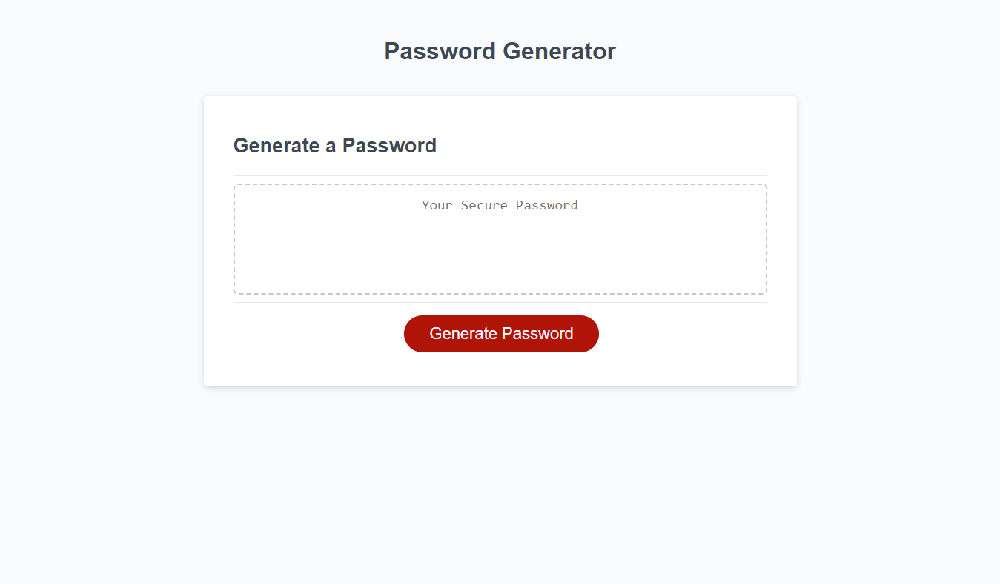
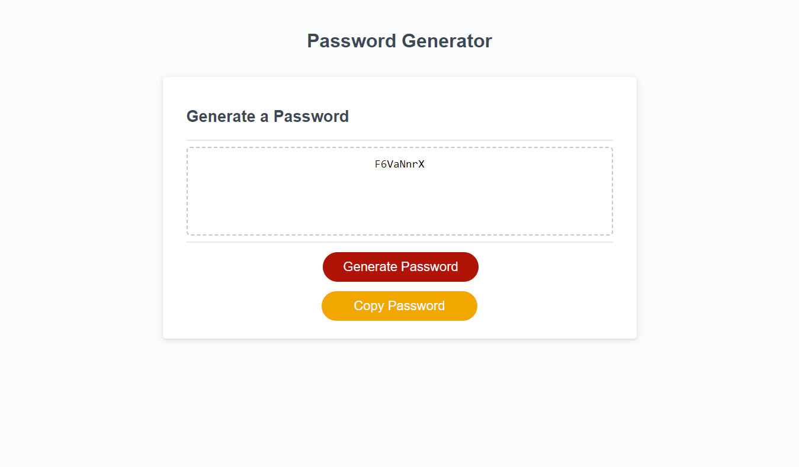

## JavaScript: Password Generator

This webpage allows an 8-128 character password to be generated around user requirements. After clicking Generate, the user will be presented with five questions. The first is for the length and the other four are confirmation of character types.

Validation is in place to enforce a minimum and maximum length. Validation is also in place to enforce that one of the four character types is chosen. This information will be displayed, but also written to the console.

Beyond the scope of this, a Copy Password button will appear after the password is generated and it will copy the password to clipboard, and confirm the copy in an alert.

The interface has been modified for multiple screen sizes.

## Mock-Up

The following shows the web application's appearance before and after the Generate process.

## Link

Repo
Website

## Reflections for Future Self (and the Grader)

This was my favorite assignment so far because I learned so much from this. At the beginning, I did not know where to start. I didn't know what to look up so I had to start at the finish line by finding a tutorial site that had code for a password generator. I studied that code, going line by line, to figure out how it worked, and learned so much.

The code to have a Copy Password button also took some work because the button has to appear AFTER the user hits Generate.

Lastly, I hit a milestone in my learning. There were lines of code that I didn't understand (I nicknamed them "mystery code"). I spent hours looking at it and then took Spencer's advice from class - I used console.log with just a piece of the mystery code to see what it was doing. I then added a ;little more code, rechecking the console, and continued. I did a lot of testing and eventually figured out that the mystery code was generating a random number with a random decimal between 0 and 1, multiplied times the length of my array of possible characters, rounded from decimal to whole, and then that was the index used to pull the first character of the password, and it did that over and over, until the loop ended (until the length was met).

What I don't want to forget is that this was not only a milestone because it was a lot of work for my brain, but when I discovered what the code I didn't understand was doing, I also discovered what the code above it (the code I thought I understood) was ACTUALLY doing. I thought the if statements were randomly choosing the character when in fact they were adding the entire array of possible characters, and then the "no longer a mystery" code was randomly choosing from that, one index at a time.

This was an awesome assignment.